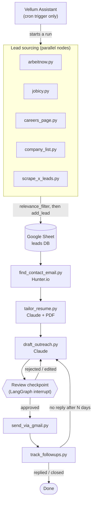
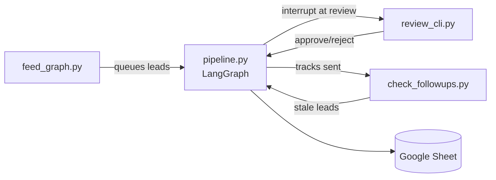

# Job Application Multi-Agent Pipeline

A personal automation pipeline for job hunting. It finds leads from job boards, company career pages, and X, structures them into one tracked list, then uses Claude to tailor a resume and draft outreach for each one. **Nothing goes out automatically** — every tailored resume and every outreach draft sits in a review queue (a Google Sheet) until it's manually approved. Once approved, it will be sent via Gmail (not yet built), and the system will track replies to trigger follow-ups on leads that go quiet (not yet built either).

This is a personal learning project, not a product. It's built and driven by me; Claude Code is used as a pair-programming guide — I review every skill's real output before moving to the next one, not just the diff.

---

## Status

| Phase | What it is | Status |
|---|---|---|
| 0 | Repo scaffold | ✅ Done |
| 1 | Leads storage/dedupe layer (`storage/sheet_client.py`) | ✅ Done |
| 2 | Scrape job boards — Arbeitnow, Jobicy, one careers page | ✅ Done |
| 2b | `company_list.py` — CSV-driven bulk company scraping (not in the original plan, added later) | ⚠️ Built, not yet verified against a live run |
| 3 | Scrape X for hiring-signal leads (Sorsa API) | ✅ Done |
| 4 | Find contact email (Hunter.io) | ✅ Done, verified end-to-end |
| 5 | Tailor resume per lead (Claude + PDF generation) | ✅ Done, thoroughly verified |
| 6 | Draft outreach per lead (Claude) | ✅ Done, verified end-to-end |
| 7 | Human review checkpoint (LangGraph interrupt) | ✅ Done, verified end-to-end |
| 8 | Send via Gmail (drafts-first, then approved-send) | ✅ Done, verified end-to-end |
| 9 | Track follow-ups (cyclic edge back into draft_outreach) | ✅ Done, verified end-to-end |
| 10 | Wire everything into an actual LangGraph graph | ✅ Done, verified end-to-end |
| 10b | Vellum Assistant as the cron trigger | ⬜ Not started |
| 11 | Deploy to a VM | ⬜ Not started |

A cross-cutting piece not in the original phase numbering: `skills/relevance_filter.py` + `config/search_criteria.json`, a keyword filter applied by every scraper before a lead is even written to the Sheet.

---

## Architecture

### Target architecture: a LangGraph graph

The pipeline is designed as a **graph**, not a script — nodes are skills, edges are what runs next. A human review step is a genuine **interrupt** (the graph pauses and waits), and follow-up tracking is a genuine **cycle** (a node's output can route back into an earlier node), not a `while` loop bolted on top.



**Why a graph instead of a script:** two of the remaining phases genuinely don't fit a linear script. Phase 7 needs the pipeline to *pause mid-run and wait for a human*, then resume exactly where it left off — that's what a LangGraph interrupt is for. Phase 9 needs a *real cycle*: a stale lead's follow-up should re-enter `draft_outreach` and go through the same review gate again, not call itself recursively or get hand-rolled with a scheduler. A plain script can fake both with enough `if`/`while` scaffolding, but the graph gives them as first-class primitives instead of ad-hoc state management.

### Current architecture: LangGraph orchestrated pipeline

**Phases 0–10 are now complete.** The LangGraph graph (`graph/pipeline.py`) orchestrates the full pipeline with proper interrupts and state management. Three orchestrator scripts manage execution:



**`orchestrator/feed_graph.py`** — picks leads from the Sheet (filtered by status/missing fields) and feeds them into the graph.  
**`orchestrator/review_cli.py`** — presents interrupt checkpoints (tailored resume + outreach draft) for human approval.  
**`orchestrator/check_followups.py`** — monitors sent leads and re-queues stale ones back through draft_outreach.

```mermaid
flowchart LR
    A1[arbeitnow.py] --> Sheet[(Google Sheet)]
    A2[jobicy.py] --> Sheet
    A3[careers_page.py] --> Sheet
    A4[company_list.py] --> Sheet
    A5[scrape_x_leads.py] --> Sheet
    Sheet --> FCE[find_contact_email.py]
    FCE --> Sheet
    Sheet --> TR[tailor_resume.py]
    TR --> Sheet
    Sheet --> DO[draft_outreach.py]
    DO --> Sheet
    Sheet -.human reviews via review_cli.py.-> Human((Review))
    Human -->|approved| Send[send_via_gmail.py]
    Send --> Track[track_followups.py]
    Track -->|stale| DO
```

Every node follows the same shape: **read leads missing some field → do the work → write that field back via `update_lead`**. This makes every skill naturally idempotent and re-runnable.

**Why build it this way first, deliberately, instead of the graph up front:**

| | |
|---|---|
| **Benefit** | Each phase is independently testable and debuggable *before* any orchestration complexity exists — critical when learning, since a bug can be isolated to one script instead of hiding inside graph control flow. ✅ **This approach paid off** — the graph integration was straightforward because each skill's business logic was already solid. |
| **Benefit** | The Sheet already behaves like a durable queue/checkpoint between stages. Migrating to LangGraph was mostly wrapping existing `run()` functions as graph nodes and adding routing — the business logic inside each skill didn't need rewriting. ✅ **Validated** — zero skill rewrites during graph migration. |
| **Benefit** | Lower blast radius: a bug in `tailor_resume.py` can't take down scraping, and re-running just the affected script picks up exactly where it left off. ✅ **Still true** — skills remain independently runnable for debugging. |
| **Now solved** | ~~No automatic sequencing today — a human runs each script in order by hand.~~ → **LangGraph now orchestrates** via `feed_graph.py`. |
| **Now solved** | ~~No conditional routing~~ → **Graph edges now handle** retry logic, approval branching, and followup cycles. |
| **Now solved** | ~~"Resume where you left off" inferred from empty columns~~ → **LangGraph checkpoints** provide first-class state persistence. |
| **Now solved** | ~~Phase 9 cyclic follow-up blocked on graph existing~~ → **Implemented** via `check_followups.py` + graph re-entry. |

---

## Design decisions and tradeoffs

| Decision | Chosen | Alternative considered | Why chosen | Tradeoff accepted |
|---|---|---|---|---|
| **LLM Backend** | **Claude Sonnet 4 (primary), Google Gemini (fallback)** | Ollama 7B/14B local models | Claude Sonnet 4 for production quality (zero-fabrication discipline), Gemini flash-lite-latest ($0 free tier, 15 RPM, 1M tokens/day) for testing when Claude API unavailable. Ollama 7B hallucinated resume content; 14B not downloaded due to size. | Gemini has lower quality output and thinking-token overhead; Claude preferred but requires API access. `skills/llm_client.py` supports both via `MODEL_BACKEND` env var. |
| **X Scraping** | **Sorsa API (primary) + GetX API (fallback)** | Sorsa-only | Sorsa went down intermittently (90%+ downtime during development). GetX API ($0.001/call, $0.10 free credit) provides resilience. | GetX credit exhausts quickly at scale; Sorsa preferred when available. Fallback auto-triggers on Sorsa timeout. |
| **Company Research** | **LLM-based extraction from job description** | Context.dev Brand API + Web Scrape | LLM analyzes the JD text directly to extract company signals (stage, tech stack, talking points). More reliable and zero external API dependency. Follows same zero-fabrication discipline as tailoring. | Can't fetch data outside the JD (no funding/headcount lookups). Acceptable since outreach should reference what's in the JD anyway, not external research the company didn't share. |
| **Relevance Filter V3** | **Strict dual-keyword matching: role_keywords AND tech_stack_keywords** | Single keyword list (V1), or software_exclude_keywords (V2) | V1/V2 let non-software roles pass (mechanical engineer, operations admin). V3 requires BOTH a software-specific role keyword ("software engineer", "backend developer") AND a tech stack keyword (react, node, python). Added `non_tech_exclude_keywords` (operations, business, sales, admin). | May filter out valid roles with unconventional titles; whole-word matching still can't catch spoken-language requirements (German B2+) or framework mismatches (Rails-specific when candidate has Django). |
| **Sheet Write Method** | **Explicit cell range update** `worksheet.update(f"A{row}:T{row}", [row])` | `append_row()` | `append_row()` wrote to wrong columns when sheet had formatting/hidden columns. Explicit range guarantees correct column mapping. All reads use `expected_headers=HEADERS` for validation. | Slightly more verbose; requires manual row calculation. |
| Leads database | Google Sheets (`gspread` + service account) | A real DB (Postgres/SQLite) | Zero infrastructure, and it *is* the human review UI for free — no separate dashboard needed, which keeps "no web dashboard" out of scope honestly. | Not queryable — every read is `get_all_records()` + Python filtering (scans the whole sheet), every write is a rate-limited Sheets API call. Fine at personal job-search volume, wouldn't scale past low thousands of rows. |
| Contact discovery | Hunter.io Domain Search | Apollo | Apollo's free tier returns `403 API_INACCESSIBLE` on its email-enrichment endpoint — confirmed live, not a docs-reading mistake. Hunter's Domain Search is usable on a free key. | Hunter's free index has real coverage gaps for small/startup domains — confirmed live: correct domain, zero emails returned. No fix for that other than accepting some leads need a manual contact lookup. `APOLLO_API_KEY` still sits unused in `.env` for reference. |
| Scraping backend | Firecrawl REST API called directly from Python | "Hermes Agent" (local Ollama model + Scrapling), per the original plan | The `hermes -z` one-shot agent CLI was unreliable — it hallucinated fake environment limitations and ignored its own tools. Ironically, Hermes itself generated a plain Firecrawl-REST-plus-regex solution that worked, which is the pattern that got ported into the real code. | Lost the "an agent figures out selectors per site" flexibility. `company_list.py`'s role-link extraction is a hand-rolled heuristic (markdown link regex + known-ATS-domain matching + a nav-link denylist) — it will miss some postings and occasionally pick up a stray link, capped at 20 roles/company as a budget guard. |
| Resume-tailoring model | Claude Sonnet 5 | Claude Haiku ("for volume", per the original plan) | Resume content directly represents the candidate to employers — fabrication risk was judged too high-stakes for a cheaper/smaller model. | Higher per-call cost, but tailoring is inherently one call per lead (low volume), so the absolute cost difference is small. Easy call once framed that way. |
| Resume PDF rendering | HTML/CSS template rendered via `xhtml2pdf` | `fpdf2` with manually positioned cells (the original approach) | `fpdf2` hit two real bugs (assumed `response.content[0]` was always text when Sonnet 5 returns a thinking block first; `multi_cell` doesn't reset the cursor like `cell` does) and even once fixed, the output didn't visually match the candidate's real resume template. HTML/CSS gives close visual control for far less code. | An extra dependency, plus PDF-encoding quirks — the default fonts only support Latin-1/WinAnsi, so a `sanitize_for_pdf` step swaps em-dashes/smart quotes/arrows for ASCII equivalents before rendering. |
| Relevance filtering | Keyword/regex filter (`relevance_filter.py`) | An LLM classifier per listing | Zero marginal cost — a scrape run can pull hundreds of listings, and an LLM call per listing just to decide "is this worth tailoring for" would be needless spend before any real filtering value is added. | Coarse. Whole-word matching fixed one real bug (substring match on `"ai"` matching inside `"maintain"`/`"email"`) but the filter still can't catch tech-stack-specific mismatches (a "Full Stack" JD that turns out to require Rails specifically) or spoken-language requirements (German B2+). Those slip through to the expensive Claude stages — caught only by the zero-fabrication discipline there, not blocked upstream. Known, accepted gap. |
| Orchestration | LangGraph graph (**planned**, not yet built) | A single linear script | Phase 7 (pause-and-wait-for-human) and Phase 9 (cycle back into `draft_outreach`) aren't naturally linear — see the Architecture section above for the full reasoning. | Until Phase 10 is built, there's no automatic sequencing between phases — see the Architecture tradeoffs table above. |
| Scheduling | Vellum Assistant as a thin cron trigger (**planned**, not yet built) | Scheduling logic built into the app itself | Keeps the pipeline's own code free of scheduling concerns — Vellum's only job is "wake up on a schedule, start a LangGraph run." | An external dependency for something as simple as a cron tick — accepted since it was already part of the original plan and keeps the app itself simpler. |

---

## Repo structure

```
api/
  main.py                FastAPI backend for dashboard
  __init__.py
graph/
  pipeline.py            LangGraph orchestration: nodes, edges, interrupts, state
orchestrator/
  feed_graph.py          Queue leads from Sheet into graph
  review_cli.py          Human review checkpoint CLI
  check_followups.py     Monitor sent leads and re-queue stale ones
frontend/
  src/                   Next.js dashboard UI
    components/
      marketing/         Landing page components
    pages/               Dashboard pages (leads list, detail view)
  public/                Static assets
  package.json           Frontend dependencies
skills/
  scrape_job_boards/
    arbeitnow.py         Arbeitnow public job API (free, no key)
    jobicy.py            Jobicy public remote-job API (free, no key)
    careers_page.py      Firecrawl scrape of a hardcoded (url, company) list
    company_list.py      CSV-driven bulk scraping + Firecrawl career-page auto-discovery
  scrape_x_leads.py      Sorsa API (primary) + GetX API (fallback) — X hiring-signal leads
  relevance_filter.py    Strict dual-keyword filter (role + tech stack) applied before every add_lead()
  find_contact_email.py  Hunter.io Domain Search + regex bio/tweet scan
  research_company.py    LLM-based company research from job description
  tailor_resume.py       Claude/Gemini-powered resume tailoring + PDF/MD/JSON generation
  draft_outreach.py      Claude/Gemini-powered outreach drafting (email or X-DM)
  send_via_gmail.py      Gmail API send (drafts-first, then approved-send)
  track_followups.py     Followup tracking and stale lead detection
  check_followups.py     Orchestrator for followup monitoring
  llm_client.py          Unified LLM client (Claude + Gemini backends)
storage/
  sheet_client.py        The shared leads DB: add_lead, get_leads, update_lead
config/
  .env                   API keys (gitignored)
  .env.example           Template for the above
  credentials.json       Google service-account key (gitignored)
  gmail_credentials.json Gmail OAuth credentials (gitignored)
  gmail_token.json       Gmail OAuth token (gitignored)
  base_resume.json       The candidate's real resume, as structured JSON
  search_criteria.json   Relevance-filter criteria (roles, tech stack, seniority, location)
resumes/
  swapnil_jain_resume.pdf                 Original resume (template reference)
  swapnil_jain_resume_{company}.{json,md,pdf}   Tailored output, one set per lead
tests/
  test_sheet_client.py   Manual verification script for Phase 1
  test_phase7_review.py  LangGraph interrupt testing
```

---

## Leads schema (Google Sheet columns)

`id, source, company, role, jd_text, contact_name, contact_email, x_handle, status, resume_version, outreach_draft, sent_at, last_checked, followup_count, listing_url, posted_date, domain`

- `source` is one of `arbeitnow`, `jobicy`, `careers_page`, `company_list`, or `x`.
- A lead needs either (`company` **and** `role`) or a non-empty `x_handle` — X leads legitimately have neither of the first two.
- `domain`, when known (from `company_list.py`'s CSV or its own guessing fallback), takes priority over `find_contact_email.py`'s own domain-guessing heuristic, regardless of source.
- Every downstream skill (`find_contact_email`, `tailor_resume`, `draft_outreach`) treats all sources identically once a lead exists — there's no branching by source past `add_lead()`, except inside `draft_outreach.py`, which drafts a short DM instead of an email specifically for `source == "x"`.

---

## Skills reference

**`storage/sheet_client.py`** — the shared data layer. `add_lead` rejects duplicates (same company+role, case-insensitive, or same non-empty `x_handle`) and raises loudly if a lead has neither identifying field. `get_leads` optionally filters by `status`. `update_lead` writes named fields by row lookup on `id`.

**Scrapers** (`arbeitnow.py`, `jobicy.py`, `careers_page.py`, `company_list.py`, `scrape_x_leads.py`) — each pulls raw postings from one source, builds a lead dict, runs it through `relevance_filter.matches_criteria`, and calls `add_lead`. Every one prints a summary line (`added` / `skipped` / `filtered_out`) so a run's outcome is never silent.

**`relevance_filter.py`** — strict dual-keyword matching (V3): requires BOTH a software-specific role keyword ("software engineer", "backend developer", "full stack") AND a tech stack keyword (react, node, python, etc.). Also filters out non-tech roles via `non_tech_exclude_keywords` (operations, business, sales, admin). Whole-word matching prevents substring false positives (e.g., "ai" inside "maintain").

**`find_contact_email.py`** — X leads get a free regex scan of their bio/tweet text first. Company leads with a known `domain` use it directly; otherwise, `arbeitnow`/`jobicy` leads get a domain *guessed* from the company name (legal-entity suffixes like "B.V."/"Inc"/"GmbH" stripped, both a smashed-together and hyphenated candidate tried against Hunter, since it costs nothing on a miss); `careers_page` leads use the real domain straight from their `listing_url`. A miss is always printed with which domains were tried, never silently counted.

**`research_company.py`** — uses LLM (Claude/Gemini) to generate structured company research from the job description. Extracts: overview, stage (early/growth/established), industry, tech signals from JD, talking points for outreach, and smart questions to ask. Designed to power both the dashboard's Company Research tab and provide richer context for `draft_outreach.py`. Zero-fabrication discipline: claims must be grounded in JD text or widely-known facts.

**`tailor_resume.py`** — sends the base resume (JSON) and a lead's JD to Claude Sonnet 4 or Gemini (via `llm_client.py`) under a strict zero-fabrication system prompt (nothing invented; bullets may be reordered/reworded but never claim new scope, tools, or metrics beyond what the base resume already supports). Saves the tailored resume as `.json`, `.md`, and a template-matched `.pdf` per lead, and prints a rough (directional-only) ATS keyword-coverage percentage.

**`draft_outreach.py`** — reads the *tailored* resume (not the base one) so the message stays consistent with what actually gets sent. Two formats by `source`: a short email (`Subject:` line + body, hard-capped at 150 words) for company leads, a casual DM (hard-capped at 60 words) for X leads. Same zero-fabrication discipline as tailoring, plus rules earned from a real review pass: no cover-letter clichés ("I came across your opening", "I look forward to hearing from you"), and every message must pull a genuinely company-specific hook from the actual JD text rather than a compliment generic enough to paste into any other outreach.

**`send_via_gmail.py`** — sends approved emails via Gmail API. Creates drafts first for final review, then sends on confirmation. Handles OAuth2 flow with `gmail_credentials.json` and `gmail_token.json`.

**`track_followups.py` + `check_followups.py`** — monitors sent leads for replies. `track_followups.py` updates `last_checked` timestamp and `followup_count`. `check_followups.py` identifies stale leads (no reply after N days) and re-queues them through `draft_outreach.py` via the graph's cyclic edge.

**`llm_client.py`** — unified LLM client supporting Claude (via Anthropic API) and Gemini (via Google GenAI REST API). Switched via `MODEL_BACKEND` env var. Claude preferred for production; Gemini (`models/gemini-flash-lite-latest`) for testing when Claude unavailable.

---

## Permanent constraints

These hold regardless of how much automation gets added later — never relaxed as a "v1 simplification":

- **Human review gate before any send.** No auto-send-once-confident shortcut, ever.
- **Every skill logs or raises loudly on failure.** Never silently skip a lead.
- **Zero fabrication** anywhere resume or outreach content touches the candidate's actual history. Stress-tested against a genuinely mismatched JD (a role requiring Ruby on Rails and German B2+, neither of which the candidate has) — both `tailor_resume` and `draft_outreach` correctly declined to fabricate or paper over the gap.
- **Out of scope for v1:** ATS auto-fill, LinkedIn scraping/automation, a web dashboard (the Sheet *is* the dashboard).

---

## Running it today

**With LangGraph orchestration (Phase 10 complete):**

```bash
# 1. Source leads (any subset, any order — still independent scripts)
python -m skills.scrape_job_boards.arbeitnow
python -m skills.scrape_job_boards.jobicy
python -m skills.scrape_job_boards.careers_page
python -m skills.scrape_job_boards.company_list path/to/companies.csv
python -m skills.scrape_x_leads 2  # optional: limit to N leads for testing

# 2. Feed leads into the graph and process
python -m orchestrator.feed_graph

# 3. Review checkpoints (interactive CLI)
python -m orchestrator.review_cli

# 4. Check for stale followups (re-queues leads needing followup)
python -m orchestrator.check_followups
```

**Or run individual skills directly (original workflow, still supported):**

```bash
# Enrich + process (each is safe to re-run; only touches leads missing that field)
python -m skills.find_contact_email
python -m skills.tailor_resume
python -m skills.draft_outreach

# Manual review in Google Sheet, then send by hand (or use send_via_gmail.py)
```

### Setup

1. `python -m venv venv` and activate it, then `pip install -r requirements.txt`.
2. Copy `config/.env.example` to `config/.env` and fill in:
   - **Required:** `GOOGLE_SHEET_ID`, Google service account credentials at `config/credentials.json`
   - **LLM Backend:** Choose one via `MODEL_BACKEND=claude` or `MODEL_BACKEND=gemini`
     - Claude: `ANTHROPIC_API_KEY=sk-ant-api03-...` (preferred for production)
     - Gemini: `GEMINI_API_KEY=...` (free tier fallback, 15 RPM, 1M tokens/day)
   - **APIs:** `SORSA_API_KEY` (X scraping, primary), `GETX_API_KEY` (X scraping fallback), `HUNTER_API_KEY` (email discovery), `FIRECRAWL_API_KEY` (web scraping), `CONTEXT_API_KEY` (company research)
   - **Gmail (Phase 8):** `GMAIL_CLIENT_ID`, `GMAIL_CLIENT_SECRET` (from Google Cloud Console OAuth2 credentials), `gmail_credentials.json`, `gmail_token.json` (auto-generated on first OAuth flow)
3. Add a Google service-account key at `config/credentials.json` (never committed — see `.gitignore`), shared with edit access on the target Sheet.
4. `config/base_resume.json` and `config/search_criteria.json` are already checked in — edit them to match your own resume and search preferences.

**API Credits Status (as of testing):**
- Context.dev: 200/500 credits remaining (10 per brand call, 1 per web scrape)
- GetX API: ~$0.09/$0.10 free credit remaining ($0.001/call)
- Sorsa API: confirmed working after downtime
- Hunter.io: domain search functional on free tier
