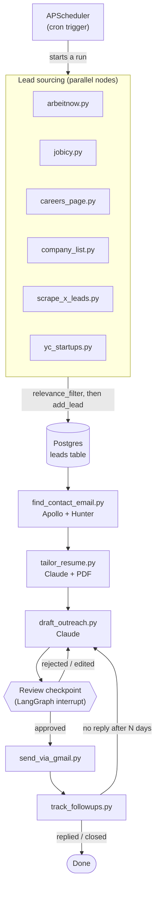
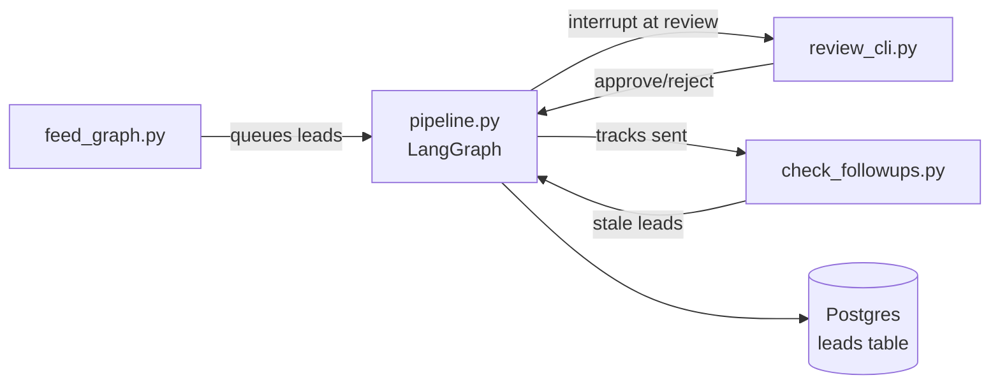

# Job Application Multi-Agent Pipeline

A personal automation pipeline for job hunting. It finds leads from job boards, company career pages, and X, structures them into one tracked list, then uses Claude to tailor a resume and draft outreach for each one. **Nothing goes out automatically** — every tailored resume and every outreach draft sits in a review queue until it's manually approved. Once approved, it sends via Gmail and tracks replies to trigger follow-ups on leads that go quiet.

**Storage note:** the leads database moved from Google Sheets to Postgres (`db/repository.py`, via SQLAlchemy + Alembic migrations) as part of a multi-tenant SaaS foundation (`db/models.py` has full per-user tables — users, resumes, search_criteria, gmail_accounts, subscriptions — plus a shared job catalog). Real multi-tenancy (Firebase Auth, per-user login) isn't wired up yet; every skill/orchestrator/API call currently resolves a single fixed "local user" via `db/current_user.py` as a stand-in. `storage/sheet_client.py` is gone — there's no Sheets fallback anymore.

This is a personal learning project, not a product. It's built and driven by me; Claude Code is used as a pair-programming guide — I review every skill's real output before moving to the next one, not just the diff.

---

## Status

| Phase | What it is | Status |
|---|---|---|
| 0 | Repo scaffold | ✅ Done |
| 1 | Leads storage/dedupe layer (originally `storage/sheet_client.py`, now `db/repository.py` over Postgres) | ✅ Done |
| 2 | Scrape job boards — Arbeitnow, Jobicy, one careers page | ✅ Done |
| 2b | `company_list.py` — CSV-driven bulk company scraping (not in the original plan, added later) | ⚠️ Built, not yet verified against a live run |
| 3 | Scrape X for hiring-signal leads (Sorsa API) | ✅ Done |
| 4 | Find contact email (Apollo.io + Hunter.io) | ✅ Done, verified end-to-end |
| 5 | Tailor resume per lead (Claude + PDF generation) | ✅ Done, thoroughly verified |
| 6 | Draft outreach per lead (Claude) | ✅ Done, verified end-to-end |
| 7 | Human review checkpoint (LangGraph interrupt) | ✅ Done, verified end-to-end |
| 8 | Send via Gmail (drafts-first, then approved-send) | ✅ Done, verified end-to-end |
| 9 | Track follow-ups (cyclic edge back into draft_outreach) | ✅ Done, verified end-to-end |
| 10 | Wire everything into an actual LangGraph graph | ✅ Done, verified end-to-end |
| 10b | Cron trigger (APScheduler, replaces the Vellum plan) | ✅ Done, verified end-to-end |
| 11 | Deploy to a VM | ⬜ Not started |

A cross-cutting piece not in the original phase numbering: `skills/relevance_filter.py` + `config/search_criteria.json`, a keyword filter applied by every scraper before a lead is even written to the database.

---

## Architecture

### Target architecture: a LangGraph graph

The pipeline is designed as a **graph**, not a script — nodes are skills, edges are what runs next. A human review step is a genuine **interrupt** (the graph pauses and waits), and follow-up tracking is a genuine **cycle** (a node's output can route back into an earlier node), not a `while` loop bolted on top.



**Why a graph instead of a script:** two of the remaining phases genuinely don't fit a linear script. Phase 7 needs the pipeline to *pause mid-run and wait for a human*, then resume exactly where it left off — that's what a LangGraph interrupt is for. Phase 9 needs a *real cycle*: a stale lead's follow-up should re-enter `draft_outreach` and go through the same review gate again, not call itself recursively or get hand-rolled with a scheduler. A plain script can fake both with enough `if`/`while` scaffolding, but the graph gives them as first-class primitives instead of ad-hoc state management.

### Current architecture: LangGraph orchestrated pipeline

**Phases 0–10 are now complete.** The LangGraph graph (`graph/pipeline.py`) orchestrates the full pipeline with proper interrupts and state management. Three orchestrator scripts manage execution:



**`orchestrator/feed_graph.py`** — picks leads from Postgres (filtered by status/missing fields) and feeds them into the graph.  
**`orchestrator/review_cli.py`** — presents interrupt checkpoints (tailored resume + outreach draft) for human approval.  
**`orchestrator/check_followups.py`** — monitors sent leads and re-queues stale ones back through draft_outreach.

```mermaid
flowchart LR
    A1[arbeitnow.py] --> DB[(Postgres\nleads table)]
    A2[jobicy.py] --> DB
    A3[careers_page.py] --> DB
    A4[company_list.py] --> DB
    A5[scrape_x_leads.py] --> DB
    DB --> FCE[find_contact_email.py]
    FCE --> DB
    DB --> TR[tailor_resume.py]
    TR --> DB
    DB --> DO[draft_outreach.py]
    DO --> DB
    DB -.human reviews via review_cli.py.-> Human((Review))
    Human -->|approved| Send[send_via_gmail.py]
    Send --> Track[track_followups.py]
    Track -->|stale| DO
```

Every node follows the same shape: **read leads missing some field → do the work → write that field back via `db.repository.update_lead`, scoped by `user_id`**. This makes every skill naturally idempotent and re-runnable. All reads/writes go through `db/current_user.py`'s single-user bootstrap for now (see the storage note above) -- multi-tenant scoping is real in the schema and repository layer, just not yet reachable from more than one user.

**Why build it this way first, deliberately, instead of the graph up front:**

| | |
|---|---|
| **Benefit** | Each phase is independently testable and debuggable *before* any orchestration complexity exists — critical when learning, since a bug can be isolated to one script instead of hiding inside graph control flow. ✅ **This approach paid off** — the graph integration was straightforward because each skill's business logic was already solid. |
| **Benefit** | The leads database already behaves like a durable queue/checkpoint between stages. Migrating to LangGraph was mostly wrapping existing `run()` functions as graph nodes and adding routing — the business logic inside each skill didn't need rewriting. ✅ **Validated** — zero skill rewrites during graph migration. |
| **Benefit** | Lower blast radius: a bug in `tailor_resume.py` can't take down scraping, and re-running just the affected script picks up exactly where it left off. ✅ **Still true** — skills remain independently runnable for debugging. |
| **Now solved** | ~~No automatic sequencing today — a human runs each script in order by hand.~~ → **LangGraph now orchestrates** via `feed_graph.py`. |
| **Now solved** | ~~No conditional routing~~ → **Graph edges now handle** retry logic, approval branching, and followup cycles. |
| **Now solved** | ~~"Resume where you left off" inferred from empty columns~~ → **LangGraph checkpoints** provide first-class state persistence. |
| **Now solved** | ~~Phase 9 cyclic follow-up blocked on graph existing~~ → **Implemented** via `check_followups.py` + graph re-entry. |

---

## Design decisions and tradeoffs

| Decision | Chosen | Alternative considered | Why chosen | Tradeoff accepted |
|---|---|---|---|---|
| **LLM Backend** | **Claude Sonnet 4 (primary), Google Gemini (fallback)** | Ollama 7B/14B local models | Claude Sonnet 4 for production quality (zero-fabrication discipline), Gemini flash-lite-latest ($0 free tier, 15 RPM, 1M tokens/day) for testing when Claude API unavailable. Ollama 7B hallucinated resume content; 14B not downloaded due to size. | Gemini has lower quality output and thinking-token overhead; Claude preferred but requires API access. `skills/llm_client.py` supports both via `MODEL_BACKEND` env var. |
| **X Scraping** | **Sorsa API (primary) + GetX API (fallback)** | Sorsa-only | Sorsa went down intermittently (90%+ downtime during development). GetX API ($0.001/call, $0.10 free credit) provides resilience. | GetX credit exhausts quickly at scale; Sorsa preferred when available. Fallback auto-triggers on Sorsa timeout. |
| **Company Research** | **LLM-based extraction from job description** | Context.dev Brand API + Web Scrape | LLM analyzes the JD text directly to extract company signals (stage, tech stack, talking points). More reliable and zero external API dependency. Follows same zero-fabrication discipline as tailoring. | Can't fetch data outside the JD (no funding/headcount lookups). Acceptable since outreach should reference what's in the JD anyway, not external research the company didn't share. |
| **Relevance Filter V3** | **Strict dual-keyword matching: role_keywords AND tech_stack_keywords** | Single keyword list (V1), or software_exclude_keywords (V2) | V1/V2 let non-software roles pass (mechanical engineer, operations admin). V3 requires BOTH a software-specific role keyword ("software engineer", "backend developer") AND a tech stack keyword (react, node, python). Added `non_tech_exclude_keywords` (operations, business, sales, admin). | May filter out valid roles with unconventional titles; whole-word matching still can't catch spoken-language requirements (German B2+) or framework mismatches (Rails-specific when candidate has Django). |
| Leads database | **Postgres (`db/repository.py` via SQLAlchemy + Alembic)** | Google Sheets (`gspread` + service account) — original v1 choice, since replaced | Sheets was zero-infrastructure and doubled as a free review UI, which was the right early tradeoff. It stopped being viable once multi-tenancy became the goal: no `user_id` concept, a rate-limited API for every read/write, and no real query/index support. Postgres gives real per-user isolation (tested — see `tests/test_repository.py`'s tenant-isolation suite), proper unique constraints for dedup instead of an in-memory cache, and room to grow past a personal job search. | Real infrastructure to run (a Postgres instance, migrations to manage) instead of "just a spreadsheet." No web dashboard existed when Sheets was the store, doubling as free review UI — that's no longer true, so a real review surface (the CLI, or the frontend's dashboard) is now required. |
| Contact discovery | **Apollo.io (primary) + Hunter.io (fallback)** | Hunter-only (original), Apollo People Search (blocked) | Apollo's People Search endpoint returns `403 API_INACCESSIBLE`, but Organization Enrichment + People Match work on standard keys. Apollo gives a *named* founder/CEO (ideal for personalized cold outreach at YC startups); Hunter provides generic role inboxes as fallback when Apollo has no coverage. | Each Apollo domain lookup spends credits (org enrichment + email unlock). Hunter's free index still has real coverage gaps for small/startup domains. Leads without any discoverable email are flagged in the dashboard. |
| Scraping backend | Firecrawl REST API called directly from Python | "Hermes Agent" (local Ollama model + Scrapling), per the original plan | The `hermes -z` one-shot agent CLI was unreliable — it hallucinated fake environment limitations and ignored its own tools. Ironically, Hermes itself generated a plain Firecrawl-REST-plus-regex solution that worked, which is the pattern that got ported into the real code. | Lost the "an agent figures out selectors per site" flexibility. `company_list.py`'s role-link extraction is a hand-rolled heuristic (markdown link regex + known-ATS-domain matching + a nav-link denylist) — it will miss some postings and occasionally pick up a stray link, capped at 20 roles/company as a budget guard. |
| Resume-tailoring model | Claude Sonnet 5 | Claude Haiku ("for volume", per the original plan) | Resume content directly represents the candidate to employers — fabrication risk was judged too high-stakes for a cheaper/smaller model. | Higher per-call cost, but tailoring is inherently one call per lead (low volume), so the absolute cost difference is small. Easy call once framed that way. |
| Resume PDF rendering | HTML/CSS template rendered via `xhtml2pdf` | `fpdf2` with manually positioned cells (the original approach) | `fpdf2` hit two real bugs (assumed `response.content[0]` was always text when Sonnet 5 returns a thinking block first; `multi_cell` doesn't reset the cursor like `cell` does) and even once fixed, the output didn't visually match the candidate's real resume template. HTML/CSS gives close visual control for far less code. | An extra dependency, plus PDF-encoding quirks — the default fonts only support Latin-1/WinAnsi, so a `sanitize_for_pdf` step swaps em-dashes/smart quotes/arrows for ASCII equivalents before rendering. |
| Relevance filtering | Keyword/regex filter (`relevance_filter.py`) | An LLM classifier per listing | Zero marginal cost — a scrape run can pull hundreds of listings, and an LLM call per listing just to decide "is this worth tailoring for" would be needless spend before any real filtering value is added. | Coarse. Whole-word matching fixed one real bug (substring match on `"ai"` matching inside `"maintain"`/`"email"`) but the filter still can't catch tech-stack-specific mismatches (a "Full Stack" JD that turns out to require Rails specifically) or spoken-language requirements (German B2+). Those slip through to the expensive Claude stages — caught only by the zero-fabrication discipline there, not blocked upstream. Known, accepted gap. |
| Orchestration | LangGraph graph (**planned**, not yet built) | A single linear script | Phase 7 (pause-and-wait-for-human) and Phase 9 (cycle back into `draft_outreach`) aren't naturally linear — see the Architecture section above for the full reasoning. | Until Phase 10 is built, there's no automatic sequencing between phases — see the Architecture tradeoffs table above. |
| Scheduling | **APScheduler `BackgroundScheduler`, embedded in the FastAPI process** | Vellum Assistant as an external cron trigger (original plan); OS-level cron; GitHub Actions | Self-contained and Python-native — no external service to depend on, no separate deploy. Reads `config/schedule.json`, so cron times are editable without touching code. Runs in-process with the API, and the same jobs can be triggered on demand from the dashboard. | Requires a long-running process (the API must stay up for cron to fire) — fine once Phase 11 puts it on a VM, but a laptop that sleeps will miss runs. `misfire_grace_time` softens this but doesn't fully solve it. |

---

## Repo structure

```
api/
  main.py                FastAPI backend for dashboard
  __init__.py
db/
  models.py              SQLAlchemy ORM models (Postgres, multi-tenant schema)
  repository.py          User-scoped CRUD over Postgres -- the real leads DB
  session.py             SQLAlchemy engine/session management
  current_user.py        Single-user bootstrap (stand-in for Firebase Auth, not yet built)
migrations/
  versions/              Alembic migration history
graph/
  pipeline.py            LangGraph orchestration: nodes, edges, interrupts, state
orchestrator/
  feed_graph.py          Queue leads from Postgres into graph
  review_cli.py          Human review checkpoint CLI
  check_followups.py     Monitor sent leads and re-queue stale ones
  pipeline_runner.py     Chains sourcing + processing into single callables (Phase 10b)
  scheduler.py           APScheduler cron trigger for the pipeline (Phase 10b)
frontend/
  src/                   Next.js dashboard UI
    components/
      marketing/         Landing page components
    pages/               Dashboard pages (leads list, detail view)
  public/                Static assets
  package.json           Frontend dependencies
skills/
  scrape_job_boards/
    arbeitnow.py         Arbeitnow public job API (free, no key)
    jobicy.py            Jobicy public remote-job API (free, no key)
    careers_page.py      Firecrawl scrape of a hardcoded (url, company) list
    company_list.py      CSV-driven bulk scraping + Firecrawl career-page auto-discovery
    greenhouse.py        Greenhouse Job Board API -- writes to the SHARED catalog (companies/jobs), not per-user leads
    lever.py             Lever Postings API -- writes to the SHARED catalog
    ashby.py             Ashby Job Postings API -- writes to the SHARED catalog
    ats_tokens.json      Seed list of known Greenhouse/Lever/Ashby company tokens
  scrape_x_leads.py      Sorsa API (primary) + GetX API (fallback) — X hiring-signal leads
  relevance_filter.py    Strict dual-keyword filter (role + tech stack) applied before every add_lead()
  find_contact_email.py  Apollo.io org enrichment (primary) + Hunter.io Domain Search (fallback)
  research_company.py    LLM-based company research from job description
  tailor_resume.py       Claude/Gemini-powered resume tailoring + PDF/MD/JSON generation
  draft_outreach.py      Claude/Gemini-powered outreach drafting (email or X-DM)
  send_via_gmail.py      Gmail API send (drafts-first, then approved-send)
  track_followups.py     Gmail-thread-reply-check helpers used by graph/pipeline.py's followup_check_node
  llm_client.py          Unified LLM client (Claude + Gemini) with transient-error retry
storage/
  checkpoints.sqlite     LangGraph checkpointer state (unrelated to the old Sheets store)
config/
  .env                   API keys + DATABASE_URL (gitignored)
  .env.example           Template for the above
  gmail_credentials.json Gmail OAuth credentials (gitignored)
  gmail_token.json       Gmail OAuth token (gitignored)
  base_resume.json       The candidate's real resume, as structured JSON
  search_criteria.json   Relevance-filter criteria (roles, tech stack, seniority, location)
  schedule.json          Cron schedule config for the scheduler (Phase 10b)
resumes/
  swapnil_jain_resume.pdf                 Original resume (template reference)
  swapnil_jain_resume_{company}.{json,md,pdf}   Tailored output, one set per lead
tests/
  conftest.py            Shared Postgres fixtures (schema setup, table truncation between tests)
  test_repository.py     Repository CRUD + hard tenant-isolation suite
  test_migrations.py     Alembic upgrade/downgrade correctness against a real Postgres
  test_current_user.py   Single-user bootstrap tests
  test_api_leads.py      FastAPI TestClient tests for the leads endpoints
  test_phase7_review.py  LangGraph interrupt testing (fully mocked externals -- see its docstring)
```

---

## Leads schema (`leads` table in Postgres, see `db/models.py`)

Every row is scoped to a `user_id` (currently always the single local user from `db/current_user.py`). Pipeline-relevant columns: `id, user_id, source, company, role, jd_text, contact_name, contact_email, x_handle, status, resume_version, outreach_draft, review_decision, applied_at, sent_at, last_checked, followup_count, listing_url, posted_date, domain`. (`db/models.py` also carries a forward-looking `resume_version_id` FK to a per-user `resumes` table and a `channel` array for the apply/outreach split -- neither is written by the current pipeline yet.)

- `source` is one of `arbeitnow`, `jobicy`, `careers_page`, `company_list`, `yc`, or `x`.
- A lead needs either (`company` **and** `role`) or a non-empty `x_handle` — X leads legitimately have neither of the first two. `company`/`role` are nullable specifically so multiple X-sourced leads for the same user don't collide with each other (Postgres treats multiple `NULL`s in a unique constraint as non-colliding).
- Dedup is a real per-tenant unique constraint (`(user_id, company, role)` and `(user_id, x_handle)`), enforced by Postgres itself on every `add_lead` call — not an in-memory cache that needs resetting per run, the way the old Sheets-based dedup worked.
- `domain`, when known (from `company_list.py`'s CSV or its own guessing fallback), takes priority over `find_contact_email.py`'s own domain-guessing heuristic, regardless of source.
- Every downstream skill (`find_contact_email`, `tailor_resume`, `draft_outreach`) treats all sources identically once a lead exists — there's no branching by source past `add_lead()`, except inside `draft_outreach.py`, which drafts a short DM instead of an email specifically for `source == "x"`.

---

## Skills reference

**`db/repository.py`** — the shared data layer, over Postgres. `add_lead` rejects duplicates (same company+role, case-insensitive, or same non-empty `x_handle`, scoped per `user_id`) via a real unique constraint and raises loudly if a lead has neither identifying field; `try_add_lead` is the same but returns `None` on a duplicate instead of raising, which is what every scraper actually calls (a duplicate during a scrape run is routine, not an error). `get_leads` optionally filters by `status`. `update_lead` writes named fields, rejecting unknown field names. Every function is `user_id`-scoped — a row that exists but belongs to another tenant is treated identically to a row that doesn't exist at all (see the tenant-isolation test suite in `tests/test_repository.py`). `db/current_user.py` resolves the single local user id every call site uses today, standing in for real per-request auth until Firebase Auth is wired up.

**Scrapers** (`arbeitnow.py`, `jobicy.py`, `careers_page.py`, `company_list.py`, `scrape_x_leads.py`, `yc_startups.py`) — each pulls raw postings from one source, builds a lead dict, runs it through `relevance_filter.matches_criteria`, and calls `add_lead`. Every one prints a summary line (`added` / `skipped` / `filtered_out`) so a run's outcome is never silent.

**`yc_startups.py`** — scrapes Y Combinator startups that are hiring and recently funded (last 4-6 months). Uses the unofficial YC OSS API (`yc-oss.github.io/api`) which mirrors YC's Algolia index — no API key needed. Filters for recent batches (Winter/Spring/Summer 2026) and prioritizes tech-focused companies (B2B, Developer Tools, Infrastructure, etc.).

**`greenhouse.py` / `lever.py` / `ashby.py`** — free, no-key public job-board connectors for the three major ATS platforms, and the only skills that write to the SHARED catalog (`companies`/`jobs` in `db/models.py`) rather than per-user leads. Each syncs one company's board per call, deduped on `(company_id, external_id)` so re-running is idempotent (a scheduled refresh never creates duplicates). A dead/mistyped token is reported and skipped, never crashes the batch. `ats_tokens.json` holds a seed list of verified company tokens per provider; `orchestrator/pipeline_runner.run_catalog_refresh()` runs all three together on a schedule. Golden tests with fixture-mocked HTTP responses cover a normal board, an empty board, a 404, malformed JSON, and dedup-on-rerun for each provider (`tests/test_ats_connectors.py`).

**`relevance_filter.py`** — strict dual-keyword matching (V3): requires BOTH a software-specific role keyword ("software engineer", "backend developer", "full stack") AND a tech stack keyword (react, node, python, etc.). Also filters out non-tech roles via `non_tech_exclude_keywords` (operations, business, sales, admin). Whole-word matching prevents substring false positives (e.g., "ai" inside "maintain").

**`find_contact_email.py`** — multi-strategy email discovery. **Apollo.io is the primary provider:** Organization Enrichment (by domain) identifies the founder/CEO via `org_chart_root_people_ids`, then People Match unlocks a verified email for that person — ideal for personalized cold outreach to YC startups. **Hunter.io is the fallback** when Apollo has no coverage: Domain Search returns generic role inboxes (engineering@, founders@). X leads get a free regex scan of their bio/tweet text first. Company leads with a known `domain` use it directly; otherwise, a domain is *guessed* from the company name (legal-entity suffixes stripped, both smashed-together and hyphenated variants tried). A miss is always printed with which domains were tried, never silently counted.

**`research_company.py`** — the key differentiator for cold outreach. Uses LLM to analyze the company and JD, then generates a **demo project idea** (2-3 days of work) that the candidate can build and attach to their email. The demo is designed to be directly relevant to the company's product/problem, making the outreach stand out. Output includes: company overview, stage, tech stack signals from JD, specific demo project (title, description, tech stack, deliverable), talking points, and fit summary. Zero-fabrication discipline applies.

**`tailor_resume.py`** — sends the base resume (JSON) and a lead's JD to Claude Sonnet 4 or Gemini (via `llm_client.py`) under a strict zero-fabrication system prompt (nothing invented; bullets may be reordered/reworded but never claim new scope, tools, or metrics beyond what the base resume already supports). Saves the tailored resume as `.json`, `.md`, and a template-matched `.pdf` per lead, and prints a rough (directional-only) ATS keyword-coverage percentage.

**`draft_outreach.py`** — reads the *tailored* resume (not the base one) so the message stays consistent with what actually gets sent. Two formats by `source`: a short email (`Subject:` line + body, hard-capped at 150 words) for company leads, a casual DM (hard-capped at 60 words) for X leads. Same zero-fabrication discipline as tailoring, plus rules earned from a real review pass: no cover-letter clichés ("I came across your opening", "I look forward to hearing from you"), and every message must pull a genuinely company-specific hook from the actual JD text rather than a compliment generic enough to paste into any other outreach.

**`send_via_gmail.py`** — sends approved emails via Gmail API. Creates drafts first for final review, then sends on confirmation. The `GMAIL_DIRECT_SEND` setting is read **live from `config/.env`** at call time (not at import time), so toggling the dashboard switch takes effect immediately without restarting the server. In direct-send mode, leads previously stuck at `draft_created` status are automatically reprocessed as real sends. Handles OAuth2 flow with `gmail_credentials.json` and `gmail_token.json`.

**`skills/track_followups.py` + `orchestrator/check_followups.py`** — monitor sent leads for replies. `skills/track_followups.py` holds the Gmail-thread-search helpers (`check_thread_for_reply`, `days_since_sent`) that `graph/pipeline.py`'s `followup_check_node` calls directly. `orchestrator/check_followups.py` is the real cron/API entry point: it reads all `sent` leads from Postgres, starts a follow-up graph run per lead, and re-queues stale ones (no reply after N days) through `draft_outreach.py` via the graph's cyclic edge.

**`llm_client.py`** — unified LLM client supporting Claude (via Anthropic API) and Gemini (via Google GenAI REST API). Switched via `MODEL_BACKEND` env var. Claude preferred for production; Gemini (`models/gemini-flash-lite-latest`) for testing when Claude unavailable. Includes **automatic retry with exponential backoff** for transient provider errors (503 overload, 429 rate limit, 5xx, timeouts) — configurable via `LLM_MAX_RETRIES` (default 5) and `LLM_BACKOFF_BASE`/`LLM_BACKOFF_MAX` env vars.

---

## Permanent constraints

These hold regardless of how much automation gets added later — never relaxed as a "v1 simplification":

- **Human review gate before any send.** No auto-send-once-confident shortcut, ever.
- **Every skill logs or raises loudly on failure.** Never silently skip a lead.
- **Zero fabrication** anywhere resume or outreach content touches the candidate's actual history. Stress-tested against a genuinely mismatched JD (a role requiring Ruby on Rails and German B2+, neither of which the candidate has) — both `tailor_resume` and `draft_outreach` correctly declined to fabricate or paper over the gap.
- **Out of scope for v1:** ATS auto-fill, LinkedIn scraping/automation. (A web dashboard used to be out of scope when the Sheet doubled as the review UI for free — that's no longer true now that Postgres is the store; `orchestrator/review_cli.py` and the `frontend/` dashboard are the real review surfaces.)

---

## Running it today

**With LangGraph orchestration (Phase 10 complete):**

```bash
# 1. Source leads (any subset, any order — still independent scripts)
python -m skills.scrape_job_boards.arbeitnow
python -m skills.scrape_job_boards.jobicy
python -m skills.scrape_job_boards.careers_page
python -m skills.scrape_job_boards.company_list path/to/companies.csv
python -m skills.scrape_job_boards.yc_startups 10  # YC startups hiring + recently funded
python -m skills.scrape_x_leads 2  # optional: limit to N leads for testing

# 2. Feed leads into the graph and process
python -m orchestrator.feed_graph

# 3. Review checkpoints (interactive CLI)
python -m orchestrator.review_cli

# 4. Check for stale followups (re-queues leads needing followup)
python -m orchestrator.check_followups
```

**Or run individual skills directly (original workflow, still supported):**

```bash
# Enrich + process (each is safe to re-run; only touches leads missing that field)
python -m skills.find_contact_email
python -m skills.tailor_resume
python -m skills.draft_outreach

# Manual review via the CLI, then send by hand (or use send_via_gmail.py)
python -m orchestrator.review_cli digest
```

**Automated scheduling (Phase 10b):**

The scheduler wraps everything above into two cron jobs, defined in `config/schedule.json`:

- **Sourcing job** (default 8:00 AM): scrape all sources → find emails → tailor → draft → feed into the review queue.
- **Follow-up job** (default 6:00 PM): check sent leads for replies and re-queue stale ones.

```bash
# Run the scheduler standalone (blocking; keeps running until Ctrl+C)
python -m orchestrator.scheduler

# Or run either pipeline once, by hand
python -m orchestrator.pipeline_runner sourcing
python -m orchestrator.pipeline_runner followups
```

To run the scheduler *inside* the API process, set `ENABLE_SCHEDULER=true` in `config/.env` and start the API. The dashboard/API can then inspect and control it:

```
GET  /api/scheduler/status          # running? next run times?
POST /api/scheduler/start           # start it
POST /api/scheduler/stop            # stop it
POST /api/scheduler/trigger/{job}   # run 'sourcing' or 'followups' now
```

Edit `config/schedule.json` to change cron times, timezone, enabled jobs, or the sourcing params (which scrapers to run, YC/X lead caps). The human review gate is unchanged — the scheduler only fills the queue and re-queues follow-ups; nothing is sent without approval.

### Setup

1. `python -m venv venv` and activate it, then `pip install -r requirements.txt`.
2. Start Postgres locally: `docker compose up -d db` (see `docker-compose.yml`). Then run migrations: `python -m alembic upgrade head` (reads `DATABASE_URL` from `config/.env`, falling back to the local docker-compose instance if unset).
3. Copy `config/.env.example` to `config/.env` and fill in:
   - **Database:** `DATABASE_URL` (defaults to the local docker-compose Postgres if unset — see `db/session.py`)
   - **Single-user bootstrap:** `LOCAL_USER_FIREBASE_UID`, `LOCAL_USER_EMAIL` (optional — sensible defaults exist; see `db/current_user.py`)
   - **LLM Backend:** Choose one via `MODEL_BACKEND=claude` or `MODEL_BACKEND=gemini`
     - Claude: `ANTHROPIC_API_KEY=sk-ant-api03-...` (preferred for production)
     - Gemini: `GEMINI_API_KEY=...` (free tier fallback, 15 RPM, 1M tokens/day)
   - **APIs:** `APOLLO_API_KEY` (email discovery, primary), `HUNTER_API_KEY` (email discovery, fallback), `SORSA_API_KEY` (X scraping, primary), `GETX_API_KEY` (X scraping fallback), `FIRECRAWL_API_KEY` (web scraping)
   - **Gmail (Phase 8):** `GMAIL_CLIENT_ID`, `GMAIL_CLIENT_SECRET` (from Google Cloud Console OAuth2 credentials), `gmail_credentials.json`, `gmail_token.json` (auto-generated on first OAuth flow)
   - **Scheduler (Phase 10b):** `ENABLE_SCHEDULER=true` to start the cron scheduler with the API (default off)
4. `config/base_resume.json` and `config/search_criteria.json` are already checked in — edit them to match your own resume and search preferences.

**API Credits Status (as of testing):**
- Apollo.io: active, org enrichment + people match functional
- Hunter.io: domain search functional on free tier (fallback)
- GetX API: ~$0.09/$0.10 free credit remaining ($0.001/call)
- Sorsa API: confirmed working after downtime
